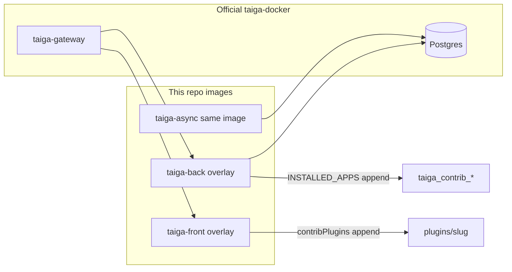
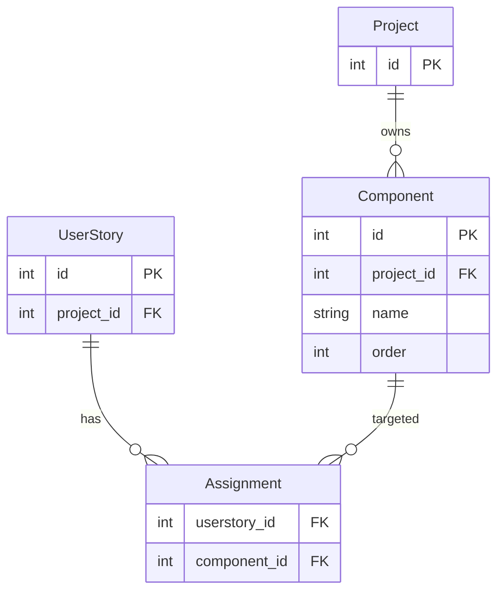

# Architecture Spine — Taiga Addons overlay kit

## Design Paradigm

**Overlay-not-fork.** Official Taiga is an immutable base. This repo only adds: Addon packages, Dockerfiles that `FROM` pinned official images, a compose override the operator merges beside official `taiga-docker`, and an upgrade playbook.

```
operator machine
  taiga-docker/                 # official, not in this repo
    docker-compose.yml
    docker-compose.override.yml # copied from this repo
    .env
this repo
  platform/                     # images + override + playbook
  addons/<name>/{back,front}/   # one Addon per folder
```

## Invariants & Rules

### AD-1 — Official source stays out of this repo [ADOPTED]

- **Binds:** all, FR-1, FR-2, FR-3, FR-5
- **Prevents:** a fork whose upgrade is a merge of `taiga-back` / `taiga-front` / `taiga-docker`
- **Rule:** Do not vendor, submodule, or patch official Taiga trees. The only allowed Official Taiga touch is a documented, isolated front-from-source rebuild under AD-5 fallback.

### AD-2 — Pin official image tags [ADOPTED]

- **Binds:** FR-2, FR-4
- **Prevents:** `:latest` drift and silent base changes
- **Rule:** Overlay `FROM` and compose override use the same explicit tag (seed `6.10.2` as of 2026-08-17). Operator production tag wins. Bumping the pin is an explicit commit.

### AD-3 — Append official config; never replace it [ADOPTED]

- **Binds:** FR-1, FR-3, FR-4
- **Prevents:** overlay that drops official env-generated `config.py` / `conf.json` (URLs, secrets, Slack/GitHub flags)
- **Rule:** After official settings exist, append `INSTALLED_APPS += ["taiga_contrib_<addon>"]` and `contribPlugins` entries. Do not volume-map a full replacement `config.py` or `conf.json` as the default path.

### AD-4 — Same overlay image for `taiga-back` and `taiga-async` [ADOPTED]

- **Binds:** FR-1, FR-4
- **Prevents:** API and worker on different code / INSTALLED_APPS
- **Rule:** Compose override replaces **both** `taiga-back` and `taiga-async` images. Official entrypoint `migrate` stays; Addon apps migrate on boot because they are in `INSTALLED_APPS`.

### AD-5 — Front injection: runtime contrib plugin first [ADOPTED]

- **Binds:** FR-3, FR-14, FR-15
- **Prevents:** silent front-core fork; also prevents shipping Chips that cannot render
- **Rule:** v1 front is a compiled contrib plugin copied into official front `dist` (`/usr/share/nginx/html/plugins/<slug>/`) and listed in `contribPlugins`. It injects the picker into User Story detail and Chips into kanban + backlog cards. If the pinned front tag has no viable hook, the fallback is an isolated front image built from the **matching** official source tag plus a patch file in this repo — that fallback is the documented upgrade tax, not a default.

### AD-6 — Addon-owned schema only [ADOPTED]

- **Binds:** FR-5, FR-6–FR-13
- **Prevents:** `ALTER TABLE` on Official Taiga core models (upgrade breakage)
- **Rule:** Persistence lives in `taiga_contrib_*` apps. Foreign keys may *reference* Official Taiga PKs (`projects_project`, `userstories_userstory`). Never add columns to those tables.

### AD-7 — Permissions map to existing Taiga roles [ADOPTED]

- **Binds:** FR-10, FR-13
- **Prevents:** a second authz system
- **Rule:** Catalog write = Project admin permission. Catalog read = Project view. Assignment write = User Story modify. Assignment/chip read = Project view. Reuse Taiga permission checks; do not invent roles.

### AD-8 — REST is Addon-owned, JWT is Official Taiga’s

- **Binds:** FR-6–FR-13
- **Prevents:** a second login; leaking Component writes through unauthenticated or foreign-project IDs
- **Rule:** Endpoints under `/api/v1/` Addon routes, authenticated with Official Taiga JWT. Every write validates Project membership and that Component ids belong to the User Story’s Project.

### AD-9 — One Addon = one folder, loadable independently

- **Binds:** FR-1, FR-3, future addons
- **Prevents:** a monolith that cannot ship Components without unrelated code
- **Rule:** `addons/<slug>/{back,front}`. Platform lists enabled slugs. A new Addon adds a folder + a line in the overlay registry — it does not rewrite the overlay contract.



## Consistency Conventions

| Concern | Convention |
| --- | --- |
| Addon Python package | `taiga_contrib_<slug>` |
| Addon front slug | same `<slug>` (`components`) |
| REST collection | `/api/v1/<slug>/...` (e.g. `/api/v1/components/`) |
| IDs | integer PKs, Taiga-style; never leak other projects |
| Dates | ISO-8601 in JSON |
| Errors | Taiga/DRF error envelope already used by Official Taiga |
| Names | trimmed; unique per Project, case-insensitive |
| Config / auth | Official Taiga JWT + AD-7 permissions |
| Logging | Addon logger `taiga_contrib_<slug>`; no secrets |
| Enablement | slug listed in `platform/addons.txt` (or equivalent registry) |

## Stack

| Name | Version |
| --- | --- |
| Official Taiga Docker | operator’s `taigaio/taiga-docker` `stable` checkout |
| `taigaio/taiga-back` | pin; seed **6.10.2** (2026-08-17 official `:latest`) |
| `taigaio/taiga-front` | same pin as back |
| `taigaio/taiga-events` / `taiga-protected` / gateway | unchanged official services |
| Postgres | whatever official compose already runs (do not replace) |
| Backend Addon | Django app matching the pinned back image (Django 3.x / DRF as shipped) |
| Frontend Addon | AngularJS 1.x contrib plugin matching pinned front |
| Compose override | Compose file format compatible with official `3.5` |

## Structural Seed

```text
{repo}/
  platform/
    docker-compose.override.yml   # image swaps for back, async, front
    back.Dockerfile               # FROM taigaio/taiga-back:<pin>
    front.Dockerfile              # FROM taigaio/taiga-front:<pin>
    entrypoint-back.sh            # append INSTALLED_APPS then official entrypoint
    patch-front-conf.sh           # append contribPlugins then nginx
    addons.txt                    # enabled slugs
    UPGRADE.md                    # playbook
  addons/
    components/
      back/                       # taiga_contrib_components
      front/                      # plugins/components
  docs/planning/
  docs/implementation/
```



`Project` and `UserStory` are Official Taiga tables (referenced, not altered). `Component` and `Assignment` are Addon tables.

## Capability → Architecture Map

| Capability | Lives in | Governed by |
| --- | --- | --- |
| Overlay apply / upgrade | `platform/` | AD-1, AD-2, AD-3, AD-4 |
| Plugin load | overlay Dockerfiles + entrypoints | AD-3, AD-5, AD-9 |
| Component catalog | `addons/components/back` + settings UI | AD-6, AD-7, AD-8 |
| Assignment | `addons/components/back` + story-detail plugin | AD-6, AD-7, AD-8, AD-5 |
| Chips | `addons/components/front` card injection | AD-5 |
| Removal safety | Addon schema only | AD-6, AD-1 |

## Deferred

- Exact AngularJS selectors / module name for detail and cards — pinned against the chosen front tag at story 3.x implementation.
- Whether delete-with-assignments is a 409 or a silent unlink at the API (UI still confirms). Product assumption: unlink after confirm.
- How many Addons share one overlay image (v1: one image, many slugs via `addons.txt`).
- Taiga Next — out of scope; do not design for it.
- Filter-by-Component, extra Component fields, other work-item types.
- CI image publish registry — local `docker compose build` is enough until an operator asks for a registry.
